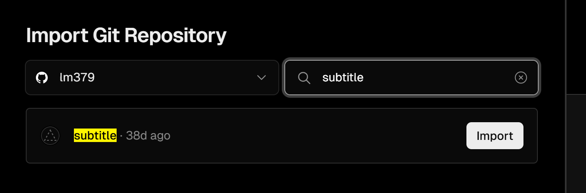

## 说明

本项目代码来自大佬[chen310](https://github.com/chen310)的replit库
当你看见本项目时，我默认你已经安装好了BilibiliPotplayer插件，如何安装请访问[原项目](https://github.com/chen310/BilibiliPotPlayer)

## 实现功能

为项目[BilibiliPotPlayer](https://github.com/chen310/BilibiliPotPlayer)实现弹幕功能
由于replit失效，vercel部署后不绑定自定义域名在境内无法访问， 因此可以通过本项目自行部署弹幕代理服务

## 部署教程
### 部署到vercel

1. fork本项目

2. 使用github登录[vercel](https://vercel.com/)

3. 创建项目，选择刚刚fork的项目，点击import，然后直接deploy即可



4. 访问http://127.0.0.1:9999/或者http://{ip}:9999/ 出现success即可
   
5. 修改Bilibili_Config.json中下面server字段为你在Vercel中设置的域名

修改前：

```json
 "server": "https://subtitle.chen310.repl.co"
```

修改后：

```json
 "server": "https://yourdomain.com"
```

6. 重启Potplayer

---


#### 自定义域名

vercel默认域名境内无法直接访问，请前往 `Settings`-`domains`添加一个自定义域名，DNS服务商使用Cloudflare的记得关闭小云朵

当出现访问你的域名出现 `success`即可

若你没有域名，可以直接使用我提供的`https://subtitle.lm379.gq`

### 本地或服务器部署

1. 安装Python3

> 如何安装请自行移步[这里](https://www.runoob.com/python3/python3-install.html)

2. 安装依赖 `pip3 install -r requirements.txt`
3. 运行

```bash
python3 main.py
```

4. 访问http://127.0.0.1:9999/或者http://{ip}:9999/ 出现success即可
5. 修改Bilibili_Config.json中下面server字段为你的代理地址
   修改前：

```json
 "server": "https://subtitle.chen310.repl.co"
```

修改后：

```json
 "server": "http://127.0.0.1:9999"
```

6. 重启Potplayer

---


