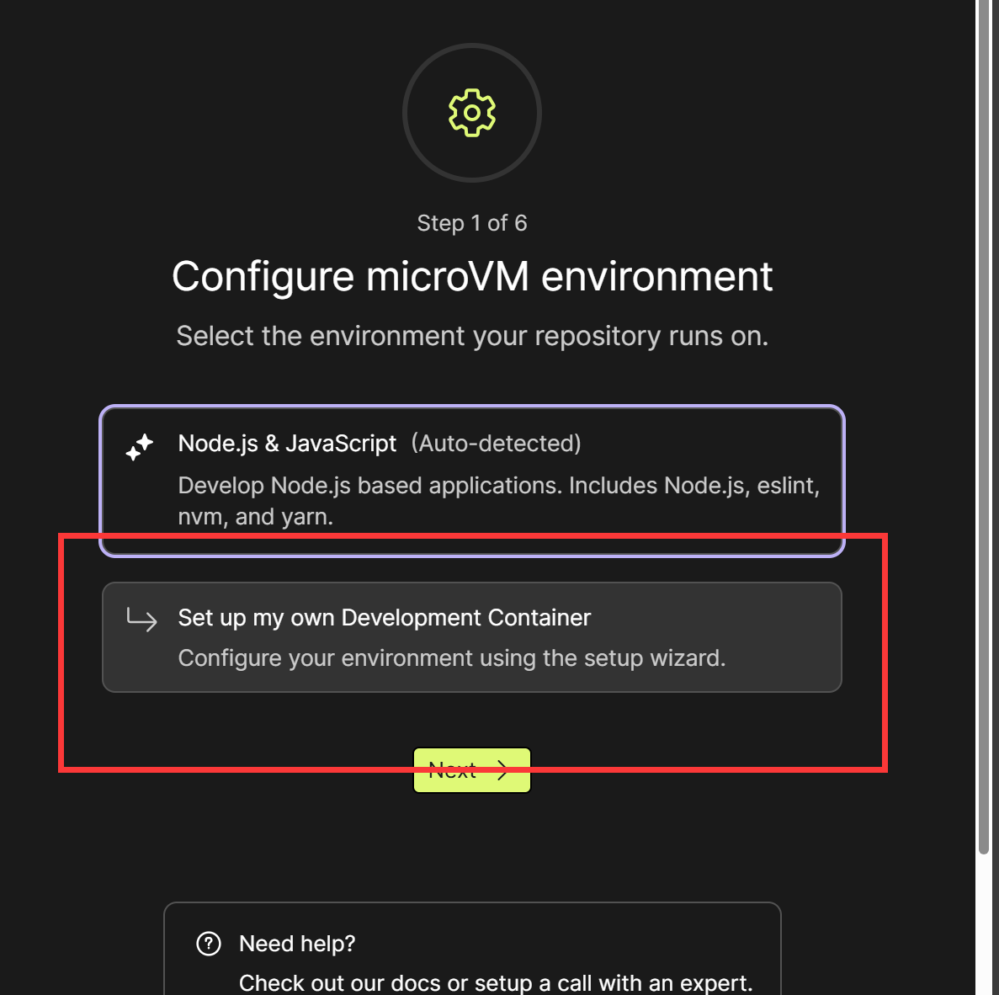
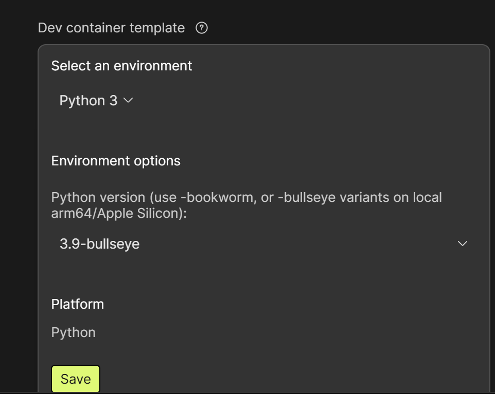
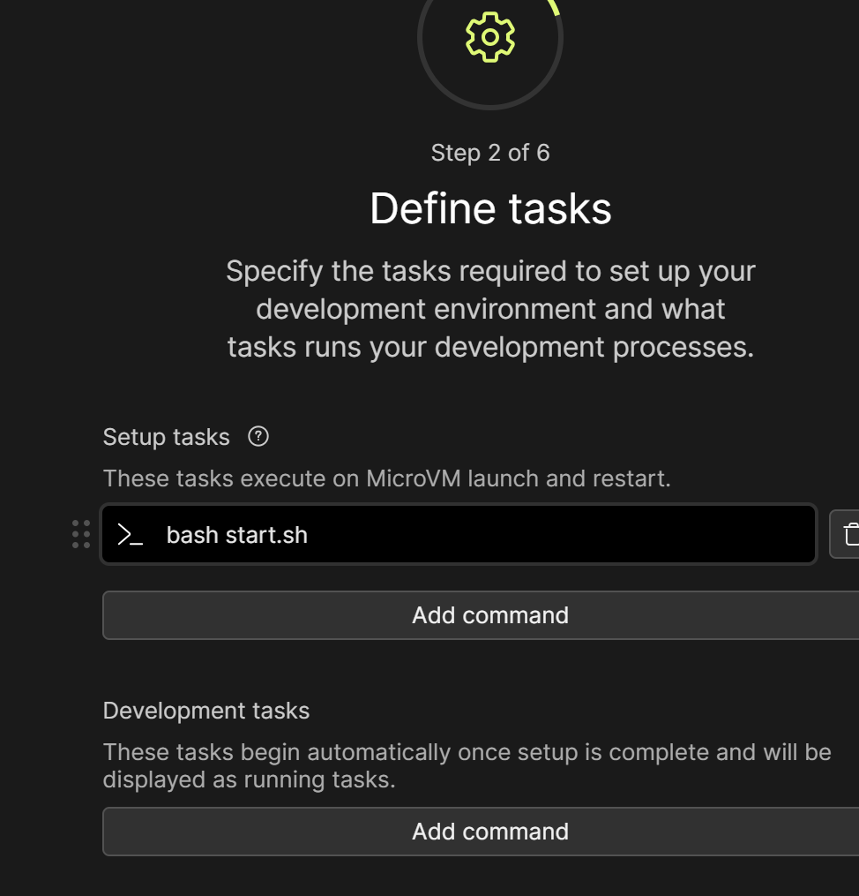
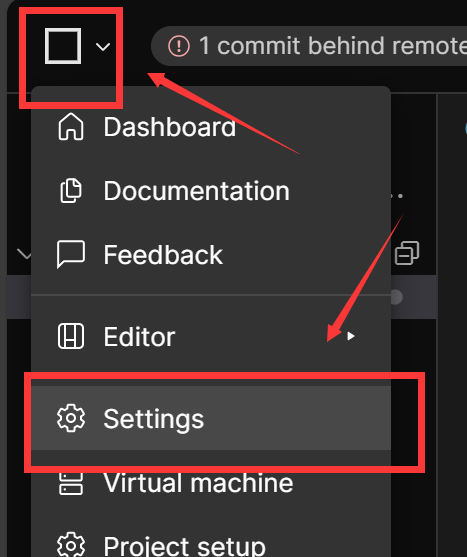
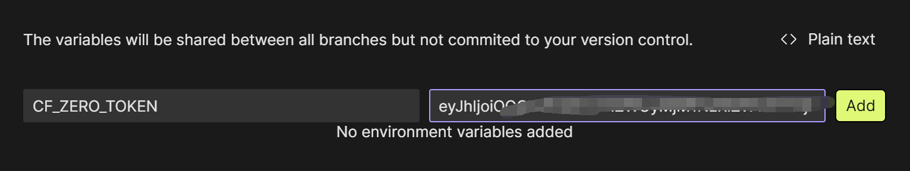
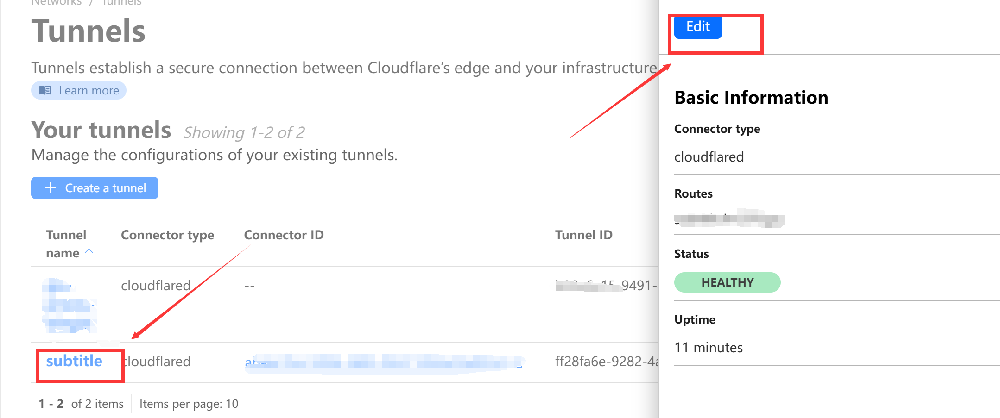
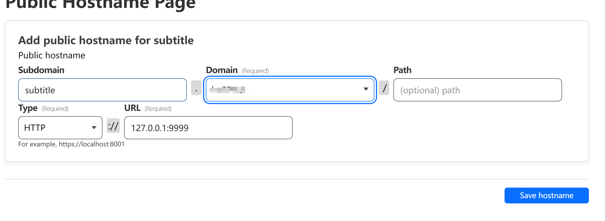

## 说明

本项目代码来自大佬[chen310](https://github.com/chen310)的replit库
当你看见本项目时，我默认你已经安装好了BilibiliPotplayer插件，如何安装请访问[原项目](https://github.com/chen310/BilibiliPotPlayer)

## 实现功能

为项目[BilibiliPotPlayer](https://github.com/chen310/BilibiliPotPlayer)实现弹幕功能
由于replit失效，vercel部署后不绑定自定义域名在境内无法访问， 因此可以通过本项目自行部署弹幕代理服务

## 部署教程

### 本地或服务器部署

1. 安装Python3

> 如何安装请自行移步[这里](https://www.runoob.com/python3/python3-install.html)

2. 安装依赖 `pip3 install -r requirements.txt`
3. 运行

```bash
python3 main.py
```

4. 访问http://127.0.0.1:9999/或者http://{ip}:9999/ 出现success即可
5. 修改Bilibili_Config.json中下面server字段为你的代理地址
   修改前：

```json
 "server": "https://subtitle.chen310.repl.co"
```

修改后：

```json
 "server": "http://127.0.0.1:9999"
```

6. 重启Potplayer

---

部署到codesanbox

1. fork本项目
2. 使用github登录[codesanbox](https://codesandbox.io/)
3. 创建项目，选择刚刚fork的项目
4. 项目部署
   点击 `project setup`，选择 `set up my own Development Container`
   
   将环境改为python3
   
   部署命令为
   `bash start.sh`
   

然后一路next即可

#### 自定义域名

由于codesanbox每次部署后的域名都会变并且官方不支持自定义域名，不过有点野路子可以做到

此方法基于cloudflare tunnels实现，因此你至少需要有一个域名托管在cloudflare上面

进入[Cloudflare](https://dash.cloudflare.com "控制台")，点击[Zero Trust](https://one.dash.cloudflare.com/)，点击Network，创建一个Tunnels，类型Cloudflared，Name任意，然后复制命令，将 `install`后面的部分保存下来

回到codesandbox添加环境变量(左上角-Settings-Env Variables)



Name为 `CF_ZERO_TOKEN`，Value为刚刚保存的install后面的部分，然后save，**重启容器**


容器启动后，可以看到隧道的状态已经变成了healthy



此时依次点击 `edit`-`Public hostnames`-`Add a public hostname`

内容填写可参考下图，其中**Subdomain**是你的**子域名**，domain选择你托管在cf上的域名，path一般留空，Type为HTTP，URL `127.0.0.1:9999`，然后Save即可

当访问你的域名出现 `success`即可
