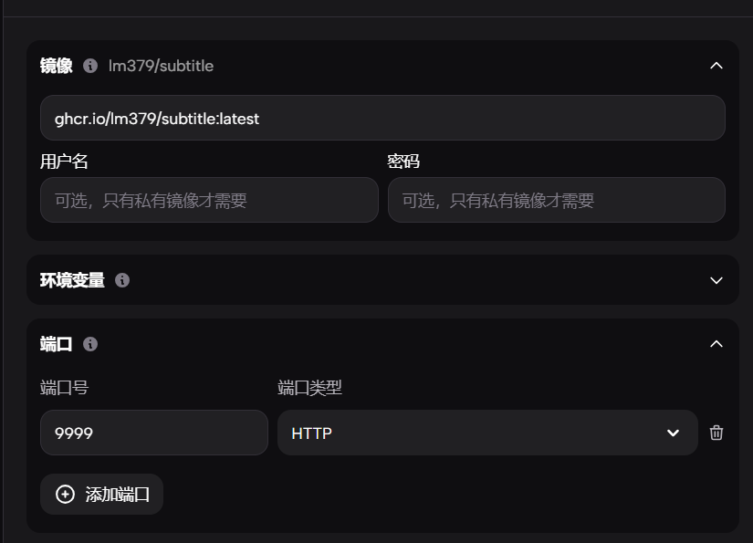
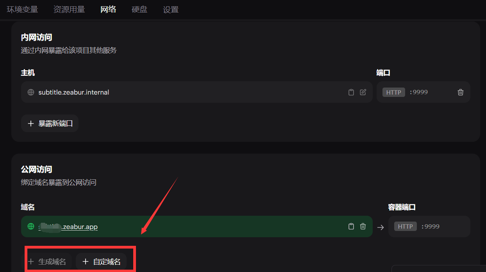

## 说明

本仓库代码来自大佬[chen310](https://github.com/chen310)的replit库  
当你看见本项目时，我默认你已经安装好了BilibiliPotplayer插件，如何安装请访问[原项目](https://github.com/chen310/BilibiliPotPlayer)

## 实现功能

为项目[BilibiliPotPlayer](https://github.com/chen310/BilibiliPotPlayer)实现弹幕功能     
通过本项目自行部署弹幕代理服务   

## 部署教程

### 部署到Zeabur

[注册链接](https://zeabur.com/referral?referralCode=lm379)

进控制台随便选一个可用区域，输入选择Docker部署，输入镜像 `ghcr.io/lm379/subtitle:latest` 并设置暴露端口 `9999`



等部署完成后，点击网络，添加一个公网访问，可以直接生成域名，或使用自己的域名



访问域名出现success即部署成功

修改Bilibili_Config.json中下面server字段为你在Zeabur中设置的域名

修改前：

```json
 "server": "https://subtitle.chen310.repl.co"
```

修改后：

```json
 "server": "https://xxxx.zeabur.app"
```

### 部署到Vercel

#### 一键部署

[](https://vercel.com/import/project?template=https://github.com/lm379/subtitle)

#### 手动部署

1. fork本项目
2. 使用github登录[vercel](https://vercel.com/)
3. 创建项目，选择刚刚fork的项目，点击import，然后直接deploy即可


4. 出现success即可


5. 修改Bilibili_Config.json中下面server字段为你在Vercel中设置的域名

修改前：

```json
 "server": "https://subtitle.chen310.repl.co"
```

修改后：

```json
 "server": "https://yourdomain.com"
```

6. 重启Potplayer

---

#### 自定义域名

vercel默认域名境内无法直接访问，请前往 `Settings` - `domains`添加一个自定义域名，DNS服务商使用Cloudflare的记得关闭小云朵

当出现访问你的域名出现 `success` 即可

若你没有域名，可以直接使用我提供的 `https://subtitle.lm379.gq`

### 本地或服务器部署(Docker)

1. 输入命令
```
docker pull ghcr.io/lm379/subtitle:latest
docker run -d \
  --name subtitle \
  -p 9999:9999 \
  --restart=always \
  ghcr.io/lm379/subtitle:latest
```

2. 测试：访问http://127.0.0.1:9999/或者http://{ip}:9999/ 出现success即可    
3. 修改Bilibili_Config.json中下面server字段为你的代理地址   
   修改前：

```json
 "server": "https://subtitle.chen310.repl.co"
```

修改后：

```json
 "server": "http://127.0.0.1:9999"
```

4. 重启Potplayer

---
